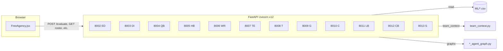

# NFL Resource Analysis — Free Agency & GM Agent Tools (Complete Reference)

**Living document.** Extend this file whenever you ship meaningful behavior, UI, or API changes. The goal is one place where a new teammate (or future you) can understand **what the tool does**, **how pieces connect**, and **what changed over time**.

**Last updated:** 2026-04-09

---

## Table of contents

1. [What this tool is](#1-what-this-tool-is)
2. [Quick start (run everything)](#2-quick-start-run-everything)
3. [Architecture overview](#3-architecture-overview)
4. [Repository map (important paths)](#4-repository-map-important-paths)
5. [Free Agency Assistant (React UI)](#5-free-agency-assistant-react-ui)
6. [Position GM APIs (FastAPI / Uvicorn)](#6-position-gm-apis-fastapi--uvicorn)
7. [Valuation & decision logic (backend)](#7-valuation--decision-logic-backend)
8. [Team context, roster, and cap](#8-team-context-roster-and-cap)
9. [Scheme & personnel adjustments](#9-scheme--personnel-adjustments)
10. [Quarterback stat projections (detail)](#10-quarterback-stat-projections-detail)
11. [Free Agency class builder (signings + departures)](#11-free-agency-class-builder-signings--departures)
12. [Frontend configuration (positions, ports, legends)](#12-frontend-configuration-positions-ports-legends)
13. [Operations & troubleshooting](#13-operations--troubleshooting)
14. [Change log / product history](#14-change-log--product-history)
15. [How to maintain this document](#15-how-to-maintain-this-document)

---

## 1. What this tool is

This repository combines **NFL analytics data** (grades, stats, contracts, schemes) with **interactive tooling**:

- **Free Agency Assistant** — A React UI where you pick a **position**, **player**, **contract ask (AAV)**, **years**, optional **team mode**, then call a **LangGraph-style GM agent** per position. You get a **SIGN / PASS** (or tiered) style outcome, **reasoning**, **fair AAV vs cap burden**, **projected stats** (where implemented), **team fit** when a team is selected, and tools to **build a multi-player signing class**, model **departures**, and see **roster net** impact.

- **Twelve separate FastAPI services** — One **Uvicorn** app per **position group** (EDGE, DI, QB, HB, WR, TE, T, G, C, LB, CB, S) so each agent loads only the CSV / logic it needs. Ports are fixed and mirrored in the frontend config.

- **Supporting Python modules** — Team roster fetch, positional need, cap percentages, `assess_team_fit` (value tier × need × cap), optional scheme/personnel hooks, team summaries / power rankings for the UI.

The **root `README.md`** is a high-level academic project blurb; **this file** is the **operational and behavioral spec** for the Free Agency stack.

---

## 2. Quick start (run everything)

### 2.1 Backend — all Free Agency APIs (ports 8002–8013)

From the **repository root** (or any directory; the script `cd`s to root):

```bash
bash backend/agent/run_all_free_agency_apis.sh
```

- Binds each API to **`127.0.0.1`** (localhost only by default).
- Sets **`PYTHONPATH`** to the repo root so `backend.agent.*` imports resolve.
- **12 processes** — see [§6](#6-position-gm-apis-fastapi--uvicorn) for the port ↔ module map.

**Background + log file (optional):**

```bash
nohup bash backend/agent/run_all_free_agency_apis.sh > /tmp/nfl-fa-apis.log 2>&1 &
```

**Stop** — Ctrl+C if foreground, or kill listeners:

```bash
for p in 8002 8003 8004 8005 8006 8007 8008 8009 8010 8011 8012 8013; do
  lsof -ti :$p | xargs kill -9 2>/dev/null || true
done
```

**Important:** Python code is loaded at process start. After editing **`backend/agent/*.py`**, you **must restart** the relevant Uvicorn process(es) (or all twelve) for changes to appear. **Refreshing the browser does not reload Python.**

### 2.2 Frontend — Vite dev server

```bash
cd frontend
npm install   # first time
npm run dev
```

Default URL is usually **`http://localhost:5173`** (confirm in the terminal). Open the **Free Agency** route from your app router (path depends on `App.jsx` / router setup).

### 2.3 Legacy single API (`main_api.py`)

There is also **`backend/agent/main_api.py`** (port **8000** in its `__main__` block) — a simpler **single-CSV** evaluator. The **Free Agency page** uses the **per-position ports**, not 8000, unless you wire it otherwise.

---

## 3. Architecture overview



- **Frontend** chooses **`cfg.port`** from `POSITION_FREE_AGENCY[positionKey]` in `frontend/src/config/freeAgencyPositionConfig.js`.
- Each **`*_main_api.py`** loads a position DataFrame, exposes **`/evaluate`**, **`/qb-players`** (or analogous player list), **`/teams`**, **`/team-roster`**, **`/team-rankings`**, etc., depending on position.
- **Evaluation** runs the compiled **LangGraph** workflow in the corresponding **`*_agent_graph.py`** (naming varies slightly; QB uses `agent_graph.py` / `qb_gm_agent`).

---

## 4. Repository map (important paths)

| Area | Path | Role |
|------|------|------|
| Free Agency UI | `frontend/src/pages/FreeAgency.jsx` | Main page: chat, team mode, class builder, departures, dialogs |
| Position config | `frontend/src/config/freeAgencyPositionConfig.js` | Ports, stat columns, market tier legend, `FA_VALUE_ANCHORS` (must match Python) |
| Run all APIs | `backend/agent/run_all_free_agency_apis.sh` | Starts 8002–8013 |
| Team + cap logic | `backend/agent/team_context.py` | Roster, need, `assess_team_fit`, reasoning paragraphs |
| QB agent + graph | `backend/agent/agent_graph.py` | QB LangGraph, `extract_last_season_stats`, `project_stats`, valuation |
| Other positions | `backend/agent/*_agent_graph.py` | HB, WR, TE, OL, ED, DI, LB, CB, S |
| Position APIs | `backend/agent/*_main_api.py` | FastAPI apps |
| Scheme / personnel | `backend/agent/scheme_personnel.py` | Optional adjustments for certain positions |
| Team summaries | `backend/agent/team_summary.py` | Rankings / directory helpers for APIs |
| Player data | `backend/ML/*.csv` | e.g. `QB.csv`, `WR.csv`, … |

---

## 5. Free Agency Assistant (React UI)

File: **`frontend/src/pages/FreeAgency.jsx`** (large single page; most FA UX lives here).

### 5.1 Core flow

- **Position** — User selects or follows position from player directory / tabs (`FA_POSITION_ORDER`).
- **Player** — Searchable select; options can come from **`/player-directory`** or position-specific player endpoints.
- **Contract** — AAV ($M/yr), years (1–7 typical).
- **Analyze / Evaluate** — POST to **`http://<host>:<port>/evaluate`** with JSON body including `player_name`, `salary_ask`, `contract_years`, optional **`team`**, **`analysis_year`**.
- **Response** — Built into a **structured card** via **`buildStructuredFreeAgent`**: decision badge, **signing grade** (frontend formula from fair AAV vs burden + team context), tier blurb, stat grid, optional stats projection toggle, year breakdown, reasoning text, team fit section.

### 5.2 Team mode

- Select a **team** and **analysis year**.
- Fetches **roster**, **positional need**, **cap** hints used by the backend to adjust the decision tier (`assess_team_fit`).
- Enables **“Add this signing to class”** (class builder requires team context on the signing).

### 5.3 GM Decision Feed (chat column)

- Append-only style list of **user** prompts and **assistant** structured cards.
- **Signing grade ring** — `SigningGrade` component; color by numeric grade.
- **Reasoning** — Raw string from backend (`reasoning`); team context paragraph often appended by **`_build_team_reasoning`** in Python.

### 5.4 Decision tier legend

- **`TIER_LADDER_BASE`** — Pure surplus % vs fair value (no team).
- **`TIER_LADDER_TEAM`** — Expanded labels when team mode applies (`Must Sign`, `Fill the Gap`, `Exceeds Cap`, etc.).
- **`TIER_DESCRIPTION`** — Short human text under badges / explain modals; kept aligned with backend tier names.

### 5.5 Signing grade (frontend)

**`signingGradeFromData(fair_aav, cap_burden, teamCtx)`** — Not the same as model composite grade. It scores the **deal** using surplus %, low-AAV and cap-footprint penalties, team need / cap ratio / room adjustments, and a value ceiling by AAV. Used for the **ring** and class aggregation.

### 5.6 Free Agency class builder

- **Multiple signings** — Each row: player, position, ask, years, stored **`signingGrade`** at evaluate time, **`fullEvaluation`** payload, cap pct, etc.
- **Persisted locally** — `localStorage` key scoped by team + year (`faClass::...`).
- **Signing class ring** — Weighted average of per-signing grades with weights ≈ **position importance × deal size** (`FA_CLASS_POS_IMPORTANCE` × profile weight from AAV).
- **Roster net ring** — Combines signing class with **modeled departures**: loss penalty, unfilled replacement penalty, coverage gap penalty, optional stress multiplier. Explained in [§11](#11-free-agency-class-builder-signings--departures).

### 5.7 Other UI affordances

- **Team rankings dialog** — Power rankings / position strength views from API.
- **Player page navigation** — Jump to detailed player route when configured.
- **Cap lock** — User can lock “starting cap for class” to run net cap math against departures and signings.

---

## 6. Position GM APIs (FastAPI / Uvicorn)

| Port | Module | Position key |
|------|--------|----------------|
| 8002 | `backend.agent.ed_main_api` | ED |
| 8003 | `backend.agent.di_main_api` | DI |
| 8004 | `backend.agent.qb_main_api` | QB |
| 8005 | `backend.agent.hb_main_api` | HB |
| 8006 | `backend.agent.wr_main_api` | WR |
| 8007 | `backend.agent.te_main_api` | TE |
| 8008 | `backend.agent.t_main_api` | T |
| 8009 | `backend.agent.g_main_api` | G |
| 8010 | `backend.agent.c_main_api` | C |
| 8011 | `backend.agent.lb_main_api` | LB |
| 8012 | `backend.agent.cb_main_api` | CB |
| 8013 | `backend.agent.s_main_api` | S |

Each app typically:

- Loads **`backend/ML/<Position>.csv`** (or merged files) at startup.
- Implements **`/evaluate`** returning `decision`, `reasoning`, nested **`data`** (grades, breakdown, projected stats, `team_context` when team provided).
- Exposes helper routes used by the Free Agency page (**teams**, **roster**, **rankings**, **player directory**, etc.) — exact set per `*_main_api.py`.

---

## 7. Valuation & decision logic (backend)

### 7.1 Fair value vs ask

Agents compute a **fair AAV** (or total value) from **composite grade** using piecewise-linear interpolation:

- **`GRADE_ANCHORS`** — Shared grade knots.
- **`VALUE_ANCHORS` / `_VALUE_ANCHORS`** — Per-position fair AAV ($M) knots.

Frontend **`FA_VALUE_ANCHORS`** and **`gradeToMarketAav`** must stay **numerically aligned** with Python or tier legends and quick estimates drift.

### 7.2 Present value / cap burden

Contracts are discounted (**typical `DISCOUNT_RATE` ~ 8%**) with **cap growth** (~6.5%/yr) so “effective cap burden” differs from nominal AAV. Surplus = fair value − burden (QB example in `agent_graph.py`).

### 7.3 Base decision tiers (contract-only)

Surplus % bands map to labels like **Exceptional Value**, **Good Signing**, **Fair Deal**, **Slight Overpay**, **Overpay**, **Poor Signing** (exact thresholds per `*_agent_graph.py`).

### 7.4 Team-adjusted tier

When **`assess_team_fit`** runs (`team_context.py`), the **base** tier is mapped through a **(need_label × base_decision)** matrix to labels like **Must Sign**, **Fill the Gap**, **Luxury Add**, **Exceeds Cap**, etc., with narrative **`note`** strings.

**Cap pressure:** Large **yr1_cap_pct / available_cap_pct** can force additional downgrades via a small internal downgrade map.

---

## 8. Team context, roster, and cap

### 8.1 `assess_team_fit(...)`

**Inputs (conceptual):** `base_decision`, `surplus_pct`, `need_score`, `need_label`, `signing_cap_pcts` (year-by-year cap %), `available_cap_pct`, `roster`, `player_name`.

**Outputs:** `(adjusted_decision, fit_summary, team_reasoning_string)`.

**Hard rule:** If **year-1 cap pct > available cap pct** → **`Exceeds Cap`** regardless of value.

### 8.2 Reasoning copy (user-facing)

The final chat paragraph often concatenates:

1. Position-specific narrative from `evaluate_value` (age, grades, stats, surplus verdict).
2. **`TEAM CONTEXT:`** block from **`_build_team_reasoning`** — top roster players, need score, cap consumption, optional multi-year cap trajectory.
3. **`combined_note`** from `assess_team_fit` — explains how **contract-only** tier relates to **team-adjusted** tier.

**Recent copy direction:** Avoid repetitive boilerplate like “this can still be a fair player price”; prefer **player-specific** and **numeric** explanations (see [§14](#14-change-log--product-history)).

---

## 9. Scheme & personnel adjustments

**File:** `backend/agent/scheme_personnel.py`

- Provides **scheme / personnel** context for **certain offensive skill positions** (e.g. HB, WR, TE as historically wired — confirm in file for current scope).
- **QB / OL** may **not** receive the same personnel-driven adjustments; the module docstring and API field comments in code are authoritative.
- Year selection follows available `*_schemes_with_personnel.csv` (or equivalent) in the ML folder.

When extending scheme logic, update **this section** and the **inline comments** near the API field in `scheme_personnel.py`.

---

## 10. Quarterback stat projections (detail)

**Primary implementation:** `backend/agent/agent_graph.py` — functions **`extract_last_season_stats`**, **`project_stats`**, helpers **`_aggregate_qb_history_by_year`**, **`_infer_games_played`**, **`_apply_qb_volume_from_rates`**, plus **`stat_projection_utils.qb_full_role_dropbacks_17`**.

### 10.1 Design goals (as implemented)

1. **Recency** — Last three seasons are **not** treated as a flat median for attempt pace / dropback pace. **Newest season is weighted highest**, then second, then third (explicit weights, e.g. 10% / 25% / 65% for three years; two-year window uses a 28% / 72% split). Same weight helper is reused for health availability and pass-grade weighting in **`predict_performance`**.

2. **Per-season 17-game pace for volume** — **`proj_dbs_linear`** uses a **weighted average** of each season’s **dropbacks ÷ games × 17**, not `(Σ weighted dropbacks) / (Σ weighted games) × 17`, which can mis-handle mixed starter/backup years.

3. **Attempt baseline** — Attempt **17-game** pace emphasizes **recency-weighted** per-game attempts plus a **small YoY trend** term; the old **median-dominated** blend was removed because it pulled elite recent seasons toward mediocre middle years.

4. **Starter assumption** — Full-role QB evaluation uses **`qb_full_role_dropbacks_17`** floors/caps so projections assume a **healthy starter workload** in FA context, with role-based reductions for fringe/backup in team mode via **`qb_dropbacks_17_for_role`**.

5. **Passer-rating yard caps** — Soft caps in **`project_stats`** scale with **attempt volume** so high-volume QBs are not artificially pinned near ~2500 yards when other parts of the model floor attempts.

6. **`predict_performance` blend** — After role-based load, a **volume reliability** factor and a blend of **trend vs typical** attempt anchors feed **`_apply_qb_volume_from_rates`**. Typical anchor now reflects **recency-weighted** pace (field **`proj_atts_typical_17g`**); median kept as **`proj_atts_median_17g`** for diagnostics.

### 10.2 Files to touch for QB projection tweaks

- `backend/agent/agent_graph.py` — Core QB graph, extraction, projection loop.
- `backend/agent/stat_projection_utils.py` — QB dropback floors, role loads, stabilized TD/INT rates.

---

## 11. Free Agency class builder (signings + departures)

### 11.1 Signings

- Stored objects include **`signingGrade`** (from `signingGradeFromData` at evaluate time) and optional **`fullEvaluation`**.
- **Class grade** = weighted mean of **adjusted** per-player grades when departures modeling applies (see below).

### 11.2 Departures

- Toggle **“Account for Departures”**.
- Add players from **current team roster** snapshot; each departure carries **grade**, **cap %**, **snaps**, **position**.
- **Roster net** score penalizes **talent walking out** and **mismatch** between signing “mass” and departure “mass” (weighted by position importance and cap weight).

### 11.3 Departure-importance bump on signing grades

When departures are **on** and the departure list is non-empty:

- Each signing receives an **additive bump** (capped, e.g. up to ~10 points) based on:
  - **Share of departure weight** at the **same position** (position importance × cap-related weight).
  - A smaller **general churn** component when the roster has any modeled exits.
- **`FA_CLASS_POS_IMPORTANCE`** — Single source of truth shared by **class rollup**, **roster net**, and **chat display** logic.

### 11.4 Chat vs class — signing grade alignment

The GM feed historically showed the **frozen** `signing_grade` from the evaluation payload. For **rows that exist in the current class** with **departures enabled**, the UI recomputes the **same bump** via **`signingGradeDisplayForChat`** so the **ring matches the class card**. A short hint can appear: **base + departure need** breakdown.

### 11.5 Roster net stress multiplier

After departure bumps are embedded in the class aggregate, roster net applies a **lighter** multiplicative stress factor on the signing baseline (e.g. reduced from 0.12 to 0.05 × stress) to **avoid double-counting** the same intuition.

---

## 12. Frontend configuration (positions, ports, legends)

**File:** `frontend/src/config/freeAgencyPositionConfig.js`

- **`POSITION_FREE_AGENCY`** — For each position: `port`, `chatTitle`, `playersPath`, `statRows`, market legend, etc.
- **`FA_POSITION_ORDER`** — Tab / directory ordering.
- **`NOTE_STD`** — Standard disclaimer string injected into legends.
- **`FA_MARKET_CALIBRATION_FACTOR`** — Must match backend calibration when changed.

**Rule:** If you change a **port** in Python `*_main_api.py`, you **must** change the **same port** here.

---

## 13. Operations & troubleshooting

### 13.1 “I changed Python but the UI is the same”

Restart Uvicorn. Use the script in [§2.1](#21-backend--all-free-agency-apis-ports-800213).

### 13.2 Smoke test a single API

```bash
curl -s -o /dev/null -w "%{http_code}\n" "http://127.0.0.1:8004/qb-players"
```

Expect **200** when CSV loaded.

### 13.3 Logs

Background runs: e.g. **`/tmp/nfl-fa-apis.log`** if you `nohup` the start script.

### 13.4 CORS / hostname

APIs default to **127.0.0.1**. If the frontend uses **`localhost`**, some environments treat that as a different origin; the Free Agency page often uses **`window.location.hostname`** for evaluate calls — if you see network errors, align host and CORS in `*_main_api.py` (`CORSMiddleware` is usually permissive).

---

## 14. Change log / product history

*Add new entries at the top under a dated subheading.*

### 2026-04-09 — Documentation, API restart, team-fit copy, class/chat grades, QB volume

- **Documentation:** Added this file **`FREE_AGENCY_TOOL_REFERENCE.md`** as the long-form reference for the Free Agency stack; intent is to **append** future changes here.
- **APIs restarted:** Routine procedure — kill listeners on **8002–8013**, run **`backend/agent/run_all_free_agency_apis.sh`** (or `nohup` + log). Required after backend edits.
- **Team fit / reasoning (`team_context.py`):** Removed generic “fair player price” boilerplate when team-adjusted tier differs from base tier or when deal exceeds cap; replaced with **player-specific** and **numeric** explanations (cap shortfall, need label, need score, tier names).
- **Frontend tier blurbs (`FreeAgency.jsx`):** Adjusted **`TIER_DESCRIPTION`** copy for **Good Signing** and **Fair Deal** to reduce repetitive “fair price” phrasing.
- **Class builder — departure importance:** Signing-class grades gain a **departure-need bump** (same position + churn) when **Account for Departures** is on; **roster net** stress multiplier toned down to limit double-counting.
- **Chat signing grade parity:** For evaluations that match a row in the **current class**, the chat **Signing Grade** ring uses **`signingGradeDisplayForChat`** so it matches the **class card** when departures modeling applies; optional **base + bump** hint.
- **Shared weights:** **`FA_CLASS_POS_IMPORTANCE`** centralizes position weights for class, roster net, and chat bump logic.
- **QB projections (`agent_graph.py`):** Recency-heavy weights for last 1–3 seasons; **weighted per-season 17-game dropback pace**; attempt baseline no longer median-dominated; **`proj_atts_typical_17g`** = recency-weighted pace, **`proj_atts_median_17g`** retained; softer **passer-rating–linked yard caps** scaled by attempts; **`predict_performance`** attempt blending favors recency; full-role **17-game starter** framing preserved via **`qb_full_role_dropbacks_17`** / role helpers.

### Earlier work (referenced in project threads — summarize as needed)

- **Free Agency UI:** Roster net vs signing-only metrics, departures without signings, cap lock UX, FA class dialogs, positional need vs power rankings (distinct concepts: **`compute_positional_need`** vs snap-weighted grades from CSVs / **`team_summary`**).
- **Scheme / personnel:** Documented that certain adjustments apply to **HB / WR / TE** (verify current code); not all positions.

---

## 15. How to maintain this document

1. **When you merge a feature** that changes user-visible behavior, add a **short bullet** under **§14** with the date.
2. If you add a **new API route**, **port**, or **CSV**, update **§4**, **§6**, and **§12** as needed.
3. If valuation math moves, update **§7** and the **config comment blocks** in **`freeAgencyPositionConfig.js`** and Python anchors.
4. Keep **§10** synchronized with any future projection or discount-rate changes for QBs (or add a new section for other positions when their projections mature).

---

*End of reference (v1).*
